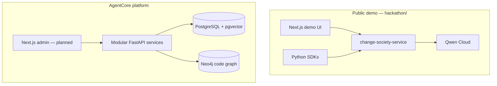
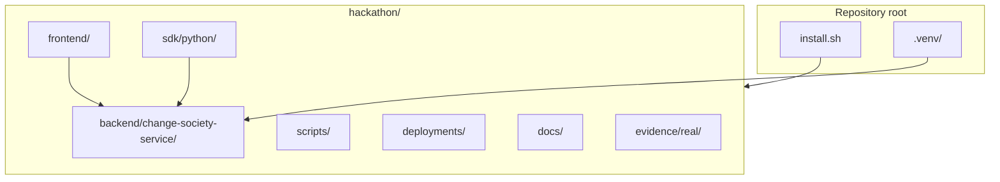
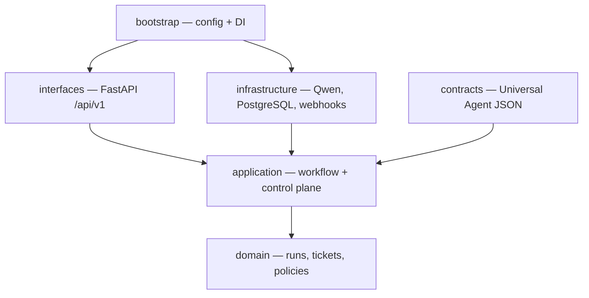
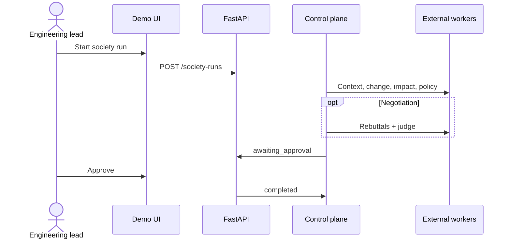
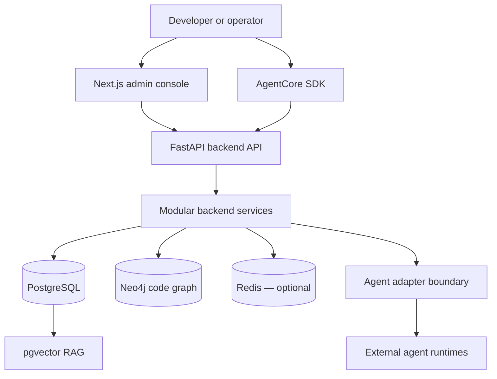

# AgentCore

AgentCore is a vendor-neutral **control plane** for registering, coordinating, governing, and observing external agent runtimes. It is not an LLM, an agent framework, or a replacement for LangGraph—connected workers (Qwen, webhooks, LangChain/LangGraph, custom services) perform execution; AgentCore owns tickets, routing, policy, approval, and audit.

This repository contains:

1. **`hackathon/`** — runnable **Change Society** demo for the Qwen Cloud Hackathon (Track 3). **Start here for install and demo.**
2. **`backend/`**, **`docs/`** — long-term AgentCore platform architecture and services.

## Table of contents

- [Change Society (hackathon) — start here](#change-society-hackathon--start-here)
  - [Hackathon repository structure](#hackathon-repository-structure)
  - [Backend layers (Change Society service)](#backend-layers-change-society-service)
  - [Society run (sequence)](#society-run-sequence)
- [Installation](#installation)
  - [Automatic install (recommended)](#automatic-install-recommended)
  - [Manual install](#manual-install)
  - [Full platform PostgreSQL (optional)](#full-platform-postgresql-optional)
- [AgentCore platform architecture](#agentcore-platform-architecture)
- [Technology baseline](#technology-baseline)
- [Documentation](#documentation)
- [Security & license](#security--license)

---

## Change Society (hackathon) — start here

| | |
|---|---|
| **Install (recommended)** | [Automatic install](#automatic-install-recommended) — `bash install.sh` |
| **Verify (no API key)** | `bash install.sh --profile verify` |
| **Hackathon README** | [hackathon/README.md](hackathon/README.md) — install, public demo, **judge live seven scenarios**, Qwen key storage |
| **Quickstart (detail)** | [hackathon/docs/01-quickstart.md](hackathon/docs/01-quickstart.md) |



### Hackathon repository structure



### Backend layers (Change Society service)



### Society run (sequence)



**Run after install (manual runtime)** — if you chose manual start in the installer, or skipped auto-start:

```bash
set -a && source hackathon/.env && set +a
PYTHONPATH=hackathon/backend/change-society-service/src \
  .venv/bin/python -m uvicorn change_society.main:app --host 127.0.0.1 --port 32500
# separate terminal: cd hackathon/frontend && npm run dev → http://localhost:32501
```

If you selected **systemd** or **Docker** during install, see [Automatic install (recommended)](#automatic-install-recommended) for status commands instead.

---

## Installation

Change Society (hackathon demo) is the primary install path on this repository. **Use the automatic installer unless you have a specific reason to install by hand.**

### Automatic install (recommended)

From the **repository root** (directory that contains `install.sh` and `hackathon/`):

```bash
bash install.sh
```

Equivalent entry point:

```bash
bash hackathon/install.sh
```

**What it does automatically**

| Step | Action |
|------|--------|
| Virtualenv | Creates `.venv/` at repo root if missing |
| Backend | `pip install` from `hackathon/backend/change-society-service/requirements.txt` and root `requirements-dev.txt` when present |
| Frontend | `npm ci` in `hackathon/frontend/` (unless `--skip-frontend`) |
| Config | Writes `hackathon/.env` with a **safe demo profile** (`fake` model, in-memory store) if the file does not exist |
| Runtime (optional) | Can start **user systemd** units, **Docker Compose** full stack, or optional **dev PostgreSQL** container — see below |

**Interactive terminal (default on a TTY)**  
The installer prints an ASCII banner and numbered menus. Each option includes a **concrete example** (commands you can copy), for example:

- Profile: `demo` vs `verify` vs production hints only  
- OS packages (Debian/Ubuntu): install `python3.12-venv`, `nodejs`, `npm`, `docker.io` via `sudo apt` when needed  
- Runtime after install: two terminals (manual), **systemd** user services, **Docker** full stack, or dependencies only  
- Optional Docker PostgreSQL for local DB experiments (demo still uses in-memory store)

**Non-interactive examples**

```bash
# Default: demo deps, no prompts (manual start after install)
bash install.sh --non-interactive

# Debian/Ubuntu: install missing OS packages, then enable API + UI as user systemd units
bash install.sh --non-interactive --install-os-deps --runtime systemd

# Proof install + deterministic end-to-end test (no browser)
bash install.sh --profile verify --non-interactive

# Full local smoke (install menus + RC gates + systemd + Docker smoke stack)
bash tests/e2e/change-society/run-full-install-smoke.sh

# Full Docker stack (requires QWEN_API_KEY and AGENTCORE_POSTGRES_PASSWORD in hackathon/.env)
bash install.sh --non-interactive --runtime docker --install-os-deps

# Optional dev PostgreSQL container only (Docker)
bash install.sh --non-interactive --with-postgres

# Preview steps without changing the machine
bash install.sh --dry-run
```

**After automatic install — check runtime**

| Runtime | Example |
|---------|---------|
| Manual (default) | Two terminals: API with `.venv/bin/python -m uvicorn …` and `cd hackathon/frontend && npm run dev` → http://localhost:32501 |
| systemd | `systemctl --user status change-society-api.service` · `journalctl --user -u change-society-api -f` |
| Docker | `docker compose -f hackathon/deployments/compose.yaml ps` · http://127.0.0.1:32500/health |

Implementation: `hackathon/scripts/install.py` and `hackathon/scripts/install_support/`. More flags and profiles: [hackathon/docs/01-quickstart.md](hackathon/docs/01-quickstart.md).

**Prerequisites (not fully automated on all OSes)**

- **Python 3.12+** (required)  
- **Node.js 20+** and **npm** for the demo UI (installer fails with clear hints if missing; use `--install-os-deps` on Debian/Ubuntu)  
- **Docker** only if you choose Docker runtime or `--with-postgres`  
- **sudo/apt** only if you opt into `--install-os-deps` or confirm OS package install in the interactive menu  

The installer does **not** create Qwen Cloud accounts or inject production secrets automatically.

### Manual install

Use this when automatic install is blocked (air-gapped mirror, custom Python layout, or policy forbids `install.sh`). The automatic path above is still **recommended** for judges and first-time setup.

**1. System prerequisites**

- Python **3.12+** with the `venv` module (on Debian/Ubuntu: `sudo apt install python3.12 python3.12-venv`)  
- **Node.js 20+** and **npm** for `hackathon/frontend`  
- Git clone of this repository  

**2. Python virtualenv and backend**

From repository root:

```bash
python3 -m venv .venv
.venv/bin/python -m pip install --upgrade pip
.venv/bin/pip install -r hackathon/backend/change-society-service/requirements.txt
.venv/bin/pip install -r requirements-dev.txt   # optional, for tests
```

**3. Frontend**

```bash
cd hackathon/frontend && npm ci && cd ../..
```

**4. Environment (safe local demo)**

```bash
cp hackathon/.env.example hackathon/.env
# Or copy the demo block from hackathon/docs/01-quickstart.md — default is CHANGE_SOCIETY_MODEL_PROVIDER=qwen (set QWEN_API_KEY).
```

**5. Run API and UI (two terminals, repository root)**

```bash
set -a && source hackathon/.env && set +a
PYTHONPATH=hackathon/backend/change-society-service/src \
  .venv/bin/python -m uvicorn change_society.main:app --host 127.0.0.1 --port 32500
```

```bash
cd hackathon/frontend && npm run dev
```

Open http://localhost:32501 .

**6. Verify (optional)**

```bash
bash tests/e2e/change-society/run-real-test.sh
```

Or re-run the automatic verifier: `bash install.sh --profile verify` (reuses existing `.venv` when present).

### Full platform PostgreSQL (optional)

For the wider AgentCore platform (not required for the hackathon in-memory demo):

```bash
cp backend/deployments/compose/postgres.example.env /tmp/agentcore-postgres.env
docker compose --env-file /tmp/agentcore-postgres.env \
  -f backend/deployments/compose/compose.yaml --profile core up -d postgres
```

Platform install runbook: [backend/runbooks/install/README.md](backend/runbooks/install/README.md).

---

## AgentCore platform architecture



---

## Technology baseline

- **Frontend:** Next.js, TypeScript  
- **Backend:** Python 3.12+, FastAPI  
- **Data:** PostgreSQL (pgvector), Neo4j; Redis when justified  
- **Local Python:** `.venv` at repository root (created by `install.sh`)  

Details: [docs/13-technology-stack-and-platform-decisions/00-index.md](docs/13-technology-stack-and-platform-decisions/00-index.md).

PostgreSQL is the runtime relational store for production-shaped deployments; the hackathon demo can use an in-memory store without Docker.

---

## Documentation

| Area | Index |
|------|--------|
| Hackathon / Change Society | [hackathon/docs/README.md](hackathon/docs/README.md) |
| **Change Society architecture (HLD/LLD + Mermaid)** | [hackathon/docs/02-architecture.md](hackathon/docs/02-architecture.md) |
| Submission pack | [hackathon/docs/14-submission-pack-index.md](hackathon/docs/14-submission-pack-index.md) |
| LangGraph / LangChain workers | [hackathon/docs/11-agent-language-and-langchain-sdk.md](hackathon/docs/11-agent-language-and-langchain-sdk.md) |
| AgentCore master docs | [docs/README.md](docs/README.md) |
| Engineering architecture | [docs/08-software-engineering-architecture/00-index.md](docs/08-software-engineering-architecture/00-index.md) |
| API standards | [docs/14-api-design-and-naming-standards/00-index.md](docs/14-api-design-and-naming-standards/00-index.md) |

---

## Security & license

- [SECURITY.md](SECURITY.md)  
- [LICENSE](LICENSE) (Apache 2.0)
