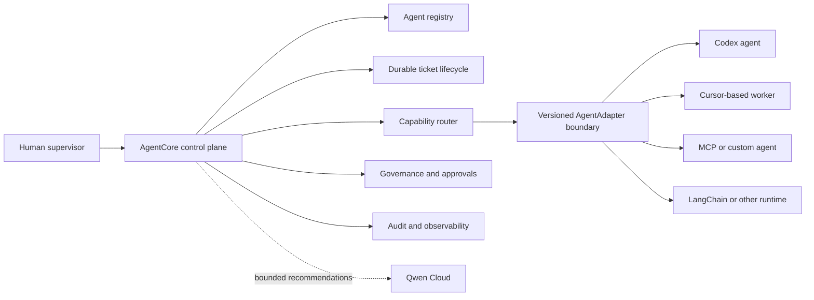

# Agent Control Plane Product Boundary

## Status

Accepted and normative. This document resolves whether AgentCore is itself an agent.

## Decision

AgentCore is a vendor-neutral control plane for registering, coordinating, governing, observing, and improving autonomous and semi-autonomous agents. AgentCore is not an agent, an LLM, an agent executor, or an agent framework.

External runtimes perform task execution. Examples include Codex, Cursor-based workers, MCP-connected tools, LangChain applications, Qwen-powered services, CI workers, and custom organization agents. They connect through versioned `AgentAdapter` contracts and remain replaceable.

## Owned Responsibilities

AgentCore owns:

- `AgentRegistry`: identity, capabilities, allowed scopes, adapter type, health, and lifecycle state;
- `AgentTicket`: durable work, acceptance criteria, dependencies, assignment, claim, progress, block, review, completion, failure, cancellation, and reassignment;
- `CapabilityRouter`: deterministic eligibility filtering and explainable selection, with optional model recommendations;
- `AdapterRegistry`: dispatch, health, cancellation, and result normalization across agent vendors;
- governance: authorization, project isolation, approval gates, rate and risk policy, and fail-closed controls;
- shared context and memory references without exposing another service's private persistence;
- audit, correlation, metrics, traces, evidence, and agent performance history.

AgentCore does not own:

- an agent's private reasoning loop, tools, prompt framework, or execution sandbox;
- vendor-specific behavior outside an adapter;
- direct mutation of repositories or business systems on behalf of an agent;
- model-generated authorization, state transitions, or approval bypasses.

## Runtime Boundary

## Qwen Boundary

Qwen Cloud may provide structured task decomposition, capability extraction, routing recommendations, conflict adjudication, evidence summarization, and evaluation. Every response must be schema-validated and auditable. Deterministic application policies remain authoritative for agent eligibility, tenant and project scope, ticket transitions, concurrency, idempotency, and human approval.

## Required Aggregate States

An agent has a governed lifecycle such as `registered`, `online`, `degraded`, `paused`, `offline`, or `revoked`. A ticket uses explicit transitions across `created`, `assigned`, `claimed`, `in_progress`, `blocked`, `review`, `completed`, `failed`, and `canceled`. Every mutation uses optimistic concurrency and creates audit evidence.

## Architectural Consequences

- Core application services depend on `AgentAdapter` and repository ports, never vendor SDKs.
- A model-backed demo worker is still an adapter-managed external-agent simulation; it is not embedded domain logic.
- LangChain is optional behind an adapter and must not become the orchestration core.
- Agent-to-agent collaboration is represented as tickets and versioned messages, not hidden sequential prompt calls.
- Admin UI and SDKs operate on agents, capabilities, tickets, dispatches, approvals, and evidence.

## Acceptance Criteria

- An agent can be registered, health-checked, paused, and selected by capability.
- A durable ticket can be assigned, dispatched, observed, reviewed, completed, or reassigned.
- At least two different adapter implementations can satisfy the same port in tests or runtime.
- Replacing an agent runtime does not change domain or application logic.
- Model failure cannot bypass deterministic policy or corrupt a ticket transition.
