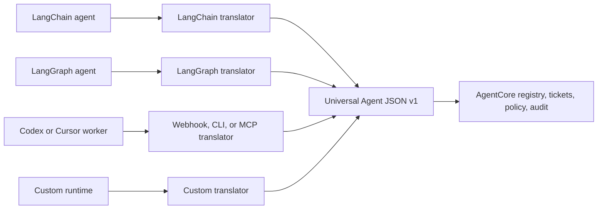

# Agent Communication Language and Runtime SDK

## Status

Accepted shared product design. The hackathon contains the first executable vertical slice; the main AgentCore implementation remains governed by the normal roadmap.

## Decision

Agents communicate with AgentCore through **Universal Agent JSON v1**, the platform lingua franca. It is a structured protocol, not a new natural language and not an agent framework. AgentCore translates runtime-specific state at its adapter boundary and never requires two agents to understand each other's private prompt format, memory representation, message classes, or tool APIs.

AgentCore continues to be a control plane. Translators normalize communication; they do not reason, create agent loops, or execute tools.

## Why a Lingua Franca Is Required

Direct vendor-to-vendor conversation creates pairwise integrations, ambiguous routing, lost evidence, and ungoverned state. A canonical envelope changes the integration cost from every-agent-to-every-agent mappings to one adapter per runtime.

## Canonical Semantics

Every message carries protocol and message identity, tenant/workspace/project/run scope, correlation and causation, sender and recipient identity or role, declared capability, durable ticket reference, intent, status, typed payload, evidence references, assumptions, confidence, risk, conflicts, requested next action, time, idempotency, and usage metadata.

Natural-language content is allowed only inside typed payload fields. Routing, authorization, ticket transitions, approval, and retries must never depend on parsing free-form prose.

## Translator Boundary

Each `RuntimeTranslator` implements two operations:

- normalize runtime-specific state or messages into Universal Agent JSON;
- render Universal Agent JSON into the minimum runtime input needed to execute one ticket.

Translation must preserve canonical fields, store unknown vendor fields under versioned extensions, reject unsupported protocol versions, fail closed on missing scope, and remain deterministic. A model may summarize or classify content as an optional audited enrichment, but model translation is never authoritative for identity, permissions, state, evidence scope, or approvals.

## Runtime SDK Strategy

The SDK is layered:

1. protocol package: canonical message and validation;
2. control-plane client: registration, heartbeat, ticket claim/progress/block/review/complete, and evidence;
3. translator registry: runtime payload normalization;
4. signed webhook worker: provider-neutral remote execution contract;
5. optional bridges: LangChain Runnable, compiled LangGraph, MCP, CLI, Codex, Cursor-based service, or custom runtime.

LangChain or LangGraph must remain optional dependencies. A compiled LangGraph or LangChain Runnable is an external managed agent and can implement the same `invoke` bridge. AgentCore does not recreate LangGraph's graph execution, persistence, streaming, or internal agent loop.

## Track 3 Consequence

The hackathon does not need a new LangGraph-like framework. Track 3 requires a multi-agent collaboration system with distinct capabilities, task division, dialogue, negotiation, conflict resolution, and measured improvement. AgentCore satisfies this through managed external workers, durable tickets, Universal Agent JSON, adapter dispatch, bounded negotiation, and evaluation. The demo must show actual Qwen-powered workers—not only a registry UI.

## Acceptance Criteria

- two different runtime translators can round-trip canonical task identity and scope;
- a LangChain Runnable or compiled LangGraph can execute an AgentCore ticket without a core dependency on either framework;
- signed webhook requests reject invalid signatures and unsupported versions;
- vendor fields cannot overwrite canonical identity, scope, capability, or ticket state;
- agents can be replaced without changing control-plane domain or application code;
- all exchanges remain correlated, auditable, evidence-aware, and project-isolated.

## Related Documents

- [09-multi-vendor-agent-network-ecosystem.md](09-multi-vendor-agent-network-ecosystem.md) — ecosystem topology, broker, and federation layers
- [hackathon/docs/23-multi-vendor-agent-network-ecosystem.md](../../hackathon/docs/23-multi-vendor-agent-network-ecosystem.md) — demo mapping
