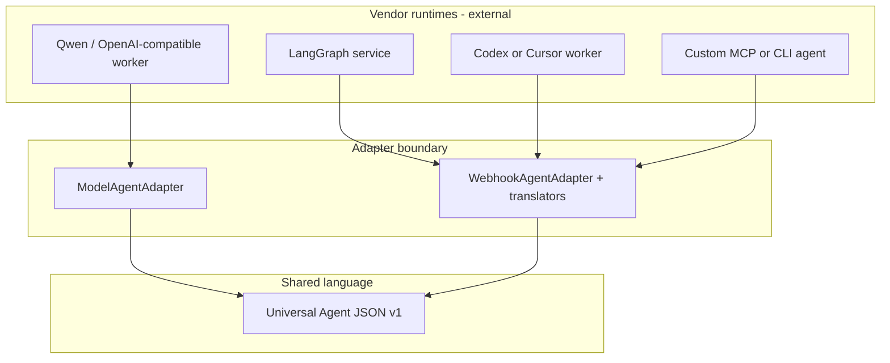
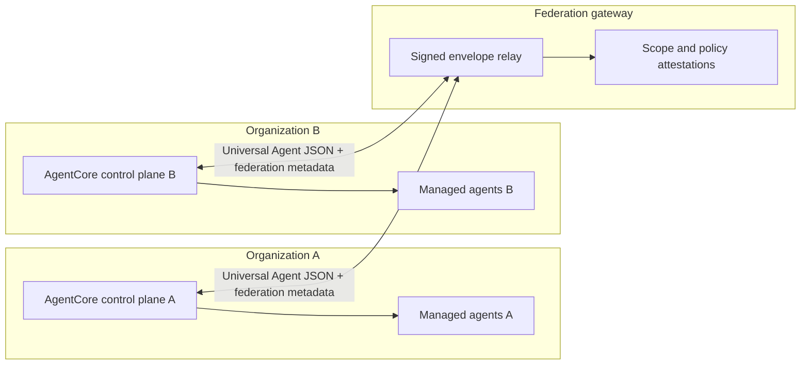

# Multi-Vendor Agent Network Ecosystem

## Status

**Product vision and architecture.** The hackathon Change Society demo implements the first vertical slice (registry, tickets, Universal Agent JSON, model and webhook adapters). The central message broker, federated control planes, and full connector registry remain on the AgentCore roadmap described in [02-high-level-design.md](02-high-level-design.md) and [03-low-level-design.md](03-low-level-design.md).

## Mission

Build an ecosystem where **agents from different vendors, frameworks, and organizations** can collaborate on governed work **without pairwise integrations**. Interaction happens through a **shared machine language** (Universal Agent JSON v1) and **authorized channels** (control plane APIs, and eventually broker pub/sub), not through ad hoc chat between opaque runtimes.

The ecosystem must support:

- **Same-tenant collaboration** — multiple managed agents on one project (engineering, security, frontend, judge).
- **Cross-runtime neutrality** — LangChain, LangGraph, Qwen Cloud, Codex, Cursor workers, MCP services, and custom webhooks participate through adapters and translators.
- **Network-scale interaction** — agents and control planes in different networks or organizations exchange **scoped, signed, auditable** messages without sharing private prompts, memory, or tool implementations.

## Problem Statement

When each vendor agent speaks only its native format (prompt templates, message classes, tool schemas, internal graph state), every new partner requires a **custom bridge**. At scale this becomes an **N×N integration matrix** with no shared audit trail, no consistent governance, and no safe way to route work by capability.

A **lingua franca** plus a **coordination layer** changes the cost model to **one adapter per runtime** and **one protocol for all agent-to-agent and agent-to-human exchanges** that the platform must govern.

## Design Principles

| Principle | Meaning |
|-----------|---------|
| **Control plane, not agent framework** | AgentCore registers agents, routes tickets, validates messages, enforces policy, and records audit. Reasoning loops stay in external workers. See [08-agent-communication-language-and-runtime-sdk.md](08-agent-communication-language-and-runtime-sdk.md). |
| **Protocol over prose** | Routing, authorization, ticket transitions, and retries **must not** depend on parsing unconstrained natural language. NL belongs in typed payload fields only. |
| **Fail closed** | Unknown protocol versions, cross-project evidence, invalid signatures, and scope violations reject the message; they do not partially apply. |
| **Immutable exchange log** | Universal Agent JSON messages are append-only evidence; workflow state changes through named ticket operations. |
| **Replaceability** | Swapping Qwen for another model provider or LangGraph for a webhook worker must not require changes to domain policy or ticket state machines. |
| **Network without trust in vendor payloads** | Federated peers authenticate and authorize; vendor extensions cannot overwrite canonical identity, scope, capability, or ticket state. |

## Common Language: Universal Agent JSON v1

Universal Agent JSON is the **shared agent language** for the ecosystem. It is not a human natural language and not a hidden prompt convention.

Canonical semantics (see [08-agent-communication-language-and-runtime-sdk.md](08-agent-communication-language-and-runtime-sdk.md)) include:

- Protocol and message identity (`protocol_version`, `message_id`, `message_type`).
- **Scope** — `tenant_id`, `workspace_id`, `project_id`, `run_id`.
- **Traceability** — `correlation_id`, `causation_id`, idempotency keys.
- **Routing** — `sender_role`, `recipient_role`, `capability`, `task_ref`.
- **Work semantics** — `intent`, `status`, typed `payload`, `evidence_refs`, confidence, risk, conflicts, next action.

Runtime-specific state is normalized at the **translator boundary** (`RuntimeTranslator` in the agent SDK). Two agents never need to understand each other's private message types.

**Normative reference implementation (hackathon slice):** `hackathon/backend/change-society-service/src/change_society/contracts/messages.py` (`UniversalAgentJson`).

## Ecosystem Topology

### Layer 1 — Managed agents (vendor runtimes)

Each **ManagedAgent** has identity, provider, adapter type (model API or signed webhook), declared capabilities, lifecycle state, heartbeat, and load. External services own their graphs, tools, and models.

### Layer 2 — Control plane (orchestration and governance)

Within a project scope, the control plane:

1. Registers and health-checks managed agents.
2. Creates **AgentTicket** units of work and routes them to capable online agents.
3. Persists directed Universal Agent JSON messages between roles (findings, rebuttals, decisions, approvals).
4. Applies **domain policies** (conflict rules, approval gates) that override model suggestions.
5. Exposes stable HTTP APIs and SDKs for operators, judges, and integrators.

**Hackathon reference:** `hackathon/backend/change-society-service/` — see [hackathon/docs/02-architecture.md](../../hackathon/docs/02-architecture.md) and [hackathon/docs/10-agent-control-plane-boundary.md](../../hackathon/docs/10-agent-control-plane-boundary.md).

### Layer 3 — Message broker (decoupled pub/sub)

For large deployments and **many subscribers**, agents publish and consume **broker events** derived from validated Universal Agent JSON. Producers do not need to know every consumer (IDE plugin, QA bot, documentation agent, department workflow).

Broker responsibilities (from [06-detailed-section-design.md](06-detailed-section-design.md)):

- Validate schema and authorize publish/subscribe.
- Route by channel and filter with tenant/project scope.
- Support replay, retry, and dead-letter with evidence.

**Roadmap:** `broker-service` in [03-low-level-design.md](03-low-level-design.md). Not fully deployed in the hackathon demo; the demo uses **direct control-plane message store and ticket routing** as a stand-in for the same contracts.

### Layer 4 — Federated network (multi-organization)

**Network interaction** means control planes or agent gateways in **different administrative domains** can participate in the same governed run without merging databases or sharing raw agent memory.

Federation rules (target architecture):

- **Peering** — mutually authenticated gateway endpoints; explicit allowlists of partner tenant IDs and capabilities.
- **Envelope** — outer signed wrapper carries federation version, source control plane ID, original message hash, and replay protection; inner payload remains Universal Agent JSON v1.
- **Scope propagation** — `tenant_id` / `workspace_id` / `project_id` (or cross-org **ProjectGroup** policy) must match on both sides before delivery.
- **No state mutation by peers** — remote control planes may **submit messages and ticket progress requests** only through documented federation APIs; they cannot directly write another tenant's registry or ticket store.
- **Audit on both sides** — each hop records correlation ID, peer identity, and delivery outcome.

This layer enables scenarios such as: a vendor's security agent in Org B reviewing evidence produced by Org A's engineering agents, with both sides retaining local audit exports.

## Interaction Patterns

### Directed dialogue (same control plane)

Roles exchange typed messages on a shared `run_id`: task assignment → specialist finding → rebuttal → coordinator decision → approval. The hackathon **Change Society** workflow demonstrates negotiation and human approval with Qwen-backed workers.

### Capability-based routing

The router selects an **online** agent whose **declared capability** matches the ticket. Different vendors can own different capabilities on the same project without sharing implementation code.

### Event-driven fan-out (broker)

One agent publishes `TEST_FAILURE_DETECTED` or `DOC_DRIFT_FOUND`; authorized subscribers react without point-to-point coupling. See [01-feature-specification.md](01-feature-specification.md) Feature 2.

### Cross-domain handoff

Engineering completion triggers governed tasks in DevOps, Support, HR, or Security using the same protocol envelope with different capability profiles. See Feature 4 in [01-feature-specification.md](01-feature-specification.md).

## Security and Governance

| Concern | Mechanism |
|---------|-----------|
| Authentication | Actor identity on API; HMAC-signed webhooks for external workers; federation mTLS or signed JWT between peers (roadmap). |
| Authorization | Scope on every command and message; broker subscribe filters; capability allowlists per agent. |
| Integrity | Immutable message log; idempotency keys; causation chains for replay detection. |
| Privacy | No requirement to expose chain-of-thought; translators map to minimum runtime input. |
| Policy supremacy | Rule engine and human approval gates override agent recommendations. |

## SDK and Integration Surfaces

Integrators should read [07-sdk-and-developer-platform.md](07-sdk-and-developer-platform.md) and [08-agent-communication-language-and-runtime-sdk.md](08-agent-communication-language-and-runtime-sdk.md).

| Surface | Purpose |
|---------|---------|
| **Protocol package** | Validate and construct Universal Agent JSON. |
| **Control-plane client** | Registration, heartbeat, tickets, messages, evidence. |
| **Runtime translators** | LangChain, LangGraph, webhook, MCP, custom. |
| **Adapter SDK** | Register connectors, map capabilities, report health. |
| **Agent SDK** | Submit findings, request approval, report progress from external runtimes. |

**Hackathon packages:** `hackathon/sdk/python/agentcore_agent_sdk/`, `change_society_sdk` — see [hackathon/docs/04-protocol-and-sdk.md](../../hackathon/docs/04-protocol-and-sdk.md).

## Implementation Map

| Capability | Hackathon demo | Full platform (roadmap) |
|------------|----------------|-------------------------|
| Universal Agent JSON v1 | Yes — validated in change-society-service | Protocol validator service |
| ManagedAgent registry + heartbeat | Yes | connector-registry + capability-registry |
| Model adapter (Qwen) | Yes | provider-adapters |
| Webhook adapter (signed) | Yes | adapter-service |
| Ticket FSM + directed messages | Yes | core-data / workflow integration |
| LangChain/LangGraph bridge | SDK slice | Runtime SDK packages |
| Central broker pub/sub | Contract only | broker-service |
| Federated peer gateway | Design (this doc) | Federation gateway service |
| Cross-domain OS workflows | Partial scenarios in tests/docs | Department workflow layer |

## Acceptance Criteria (Ecosystem)

The ecosystem vision is satisfied when:

1. **Two different vendor runtimes** on the same project complete tickets and exchange Universal Agent JSON without custom pairwise code between them.
2. **Replacing one runtime** (e.g. swap webhook worker or model provider) leaves control-plane domain logic unchanged.
3. **All exchanges** are correlatable, scoped, and auditable; cross-project evidence is rejected unless ProjectGroup policy allows it.
4. **Broker mode** (when enabled) delivers the same semantic events to subscribers with retry and dead-letter behavior.
5. **Federation mode** (when enabled) allows a partner control plane to participate in a run with mutual authentication and without direct database access.

## Related Documents

- [00-index.md](00-index.md) — interoperability phase index
- [01-feature-specification.md](01-feature-specification.md) — functional requirements
- [02-high-level-design.md](02-high-level-design.md) — components and flows
- [08-agent-communication-language-and-runtime-sdk.md](08-agent-communication-language-and-runtime-sdk.md) — lingua franca and translators
- [hackathon/docs/23-multi-vendor-agent-network-ecosystem.md](../../hackathon/docs/23-multi-vendor-agent-network-ecosystem.md) — demo mapping and judge-facing summary
- [hackathon/docs/11-agent-language-and-langchain-sdk.md](../../hackathon/docs/11-agent-language-and-langchain-sdk.md) — LangChain/LangGraph boundary
